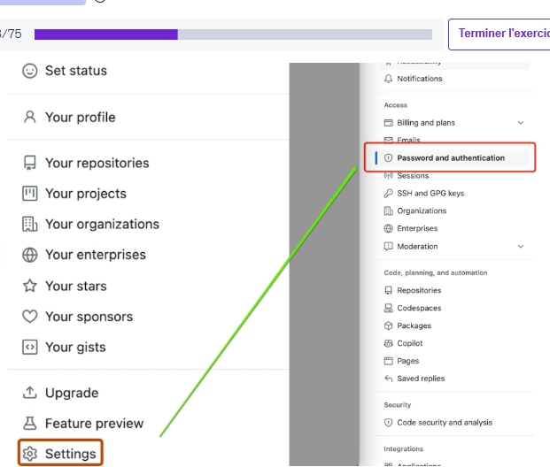

# Account

::::{grid}
:::{grid-item-card} Question
:::

:::{grid-item-card} Réponse
:::

:::{grid-item-card} Explication
:::

:::{grid-item-card} Source
:::
::::

## Type

::::{grid}
:::{grid-item-card}
What are the three types of GitHub accounts ?
:::

:::{grid-item-card}
**Personal**, **Organization**, and **Enterprise**.
:::

:::{grid-item-card}
:::

:::{grid-item-card}
* https://docs.github.com/en/get-started/learning-about-github/types-of-github-accounts
:::
::::

## Authenticate

### Glossaire

::::{grid}
:::{grid-item-card}
* SAML
* SSO
* SCIM
* IdP
* IAM
:::

:::{grid-item-card}
* Security Assertion Markup Language
* Single Sign-On
* System for Cross-domain Identity Management
* Identity Provider
* Identity and Access Management
:::

:::{grid-item-card}
:::

:::{grid-item-card}
* 
* 
* 
* 
* [IAM](https://docs.github.com/en/enterprise-cloud@latest/admin/concepts/identity-and-access-management/identity-and-access-management-fundamentals)
:::
::::

### Best practice

::::{grid}
:::{grid-item-card}
What authentication method does GitHub strongly recommend avoiding when dealing with highly sensitive information ?
:::

:::{grid-item-card}
* Deploy keys
* SSH keys
* Personal access tokens
* {bdg-success}`Correct` Username and password
:::

:::{grid-item-card}
:::

:::{grid-item-card}
* https://learn.microsoft.com/en-us/training/modules/github-introduction-administration/3-how-github-authentication-works
:::
::::

::::{grid}
:::{grid-item-card}
What is the first step in ensuring secure software development in an enterprise ?
:::

:::{grid-item-card}
* Limiting access to resources based on user roles and permissions.
* {bdg-success}`Correct` Configuring authentication using tools available with the identity provider (IdP).
* Enabling two-factor authentication (2FA) for every GitHub user.
* Balancing ease of use with secure organizational requirements.
:::

:::{grid-item-card}
Configuring authentication is the first step in ensuring secure software development in an enterprise, and using the tools available with the identity provider (IdP) is critical for getting the most value from GitHub.

```{admonition} Example
An enterprise sets up authentication with GitHub using SAML SSO with their chosen identity provider (IdP) to ensure secure access to their GitHub organization.
```
:::

:::{grid-item-card}
:::
::::


### A2F

::::{grid}
:::{grid-item-card}
Which option is not available for GitHub two-factor authentication ?
:::

:::{grid-item-card}
* GitHup Mobile.
* {bdg-success}`Correct` GitHub App.

```{danger}
*Attention au piège avec **GitHub Mobile** et **Authentication App** qui sont 2 méthodes valides*
```
* SMS.
* Security Key.
:::

:::{grid-item-card}
- **SMS**: Receive authentication codes via text message to a mobile phone number linked to your GitHub account.
- **Authentication App**: Use an authentication app like Google Authenticator, Authy, or similar apps to generate authentication codes.
- **Security Key**: Use a physical security key, such as a YubiKey, to provide an additional layer of security. This method is often considered more secure than SMS or authentication apps.
- **GitHub Mobile**: You can use GitHub Mobile for 2FA when signing into your GitHub account in a web browser. 2FA with GitHub Mobile does not rely on TOTP, and instead uses public-key cryptography to secure your account.
:::

:::{grid-item-card}
* https://docs.github.com/en/authentication/securing-your-account-with-two-factor-authentication-2fa/configuring-two-factor-authentication
:::
::::

::::{grid}
:::{grid-item-card}
Which of the following authentication methods is considered the most secure way to authenticate with 2FA on GitHub Enterprise ?
:::

:::{grid-item-card}
Security keys
:::

:::{grid-item-card}
:::

:::{grid-item-card}
* https://docs.github.com/en/code-security/supply-chain-security/end-to-end-supply-chain/securing-accounts
:::
::::

::::{grid}
:::{grid-item-card}
Where can you find the option to enable two-factor authentication (2FA) in GitHub ?
:::

:::{grid-item-card}
In the "Access" section under "Password and authentication" in the user "Settings".
:::

:::{grid-item-card}

:::

:::{grid-item-card}
* https://github.com/settings/security
:::
::::


### PAT

::::{grid}
:::{grid-item-card}
What is the purpose of **P**ersonal **A**ccess **T**okens (PATs) in GitHub ?
:::

:::{grid-item-card}
To authenticate to GitHub API or command line.
:::

:::{grid-item-card}
Personal access tokens (PATs) in GitHub serve as an alternative to passwords for authentication when interacting with GitHub API or the command line.\
Users generate tokens and tie them to specific permissions for repositories or organizations.
:::

:::{grid-item-card}
* https://docs.github.com/en/authentication/keeping-your-account-and-data-secure/managing-your-personal-access-tokens
:::
::::

::::{grid}
:::{grid-item-card}
What distinguishes `Fine-Grained Personal Access Tokens` from `Personal Access Tokens (Classic)` in GitHub ?
:::

:::{grid-item-card}
* `Fine-Grained Tokens` have broader access permissions compared to `Personal Access Tokens (Classic)`.
* {bdg-success}`Correct` `Fine-Grained Tokens` expire, while `Personal Access Tokens (Classic)` are allowed to live forever.
* `Personal Access Tokens (Classic)` are targeted at specific repositories, while `Fine-Grained Tokens` have access to all repositories by default.
* `Personal Access Tokens (Classic)` offer more granular control over permissions than `Fine-Grained Tokens`.
:::

:::{grid-item-card}
`Fine-Grained Personal Access Tokens` in GitHub offer more precise control over permissions compared to Personal Access Tokens (Classic).\
While `Personal Access Tokens (Classic)` have broad access scopes and can live indefinitely, `Fine-Grained Tokens` have over 50 granular permissions and expire after a specified duration.\
`Fine-Grained Tokens` only have access to repositories or organizations explicitly granted, whereas `Personal Access Tokens (Classic)` have access to all repositories by default.

* *Right Option:* `Fine-Grained Tokens` expire, while `Personal Access Tokens (Classic)` are allowed to live forever.
* *Wrong Option:* `Fine-Grained Tokens` have broader access permissions compared to `Personal Access Tokens (Classic)`.\
It is incorrect because `Fine-Grained Tokens` provide more specific, limited access compared to `Personal Access Tokens (Classic)`.
* *Wrong Option:* `Personal Access Tokens (Classic)` offer more granular control over permissions than `Fine-Grained Tokens`.\
It is incorrect because it is the reverse of the actual distinction. `Personal Access Tokens (Classic)` offer broader access permissions, while `Fine-Grained Tokens` provide more granular control.
* *Wrong Option:* `Personal Access Tokens (Classic)` are targeted at specific repositories, while `Fine-Grained Tokens` have access to all repositories by default.\
It is incorrect because `Fine-Grained Tokens` do not have access to all repositories by default; they only have access to explicitly granted repositories.


:::

:::{grid-item-card}
* https://github.blog/security/application-security/introducing-fine-grained-personal-access-tokens-for-github/#fine-grained-personal-access-tokens-in-action
* https://docs.github.com/en/enterprise-server@3.10/authentication/keeping-your-account-and-data-secure/managing-your-personal-access-tokens#fine-grained-personal-access-tokens
:::
::::

### SSO
::::{grid}
:::{grid-item-card}
What is the purpose of SAML SSO in GitHub organization management ?
:::

:::{grid-item-card}
To allow users to sign in to all their applications with one set of credentials.
:::

:::{grid-item-card}
SAML SSO in GitHub organization management allows users to sign in to all their applications with one set of credentials authenticated by the identity provider (IdP).

```{admonition} Example
An employee logs into GitHub using their company's single sign-on (SSO) system, which also provides access to other enterprise applications.
```
:::

:::{grid-item-card}
https://learn.microsoft.com/en-us/training/modules/authenticate-authorize-user-identities-github/2-user-identity-access-management
:::
::::


::::{grid}
:::{grid-item-card}
How does SAML SSO work with GitHub Enterprise ?
:::

:::{grid-item-card}
Users are redirected to the Identity Provider (IdP) to authenticate.
:::

:::{grid-item-card}
With SAML SSO, when a user accesses resources within a GitHub organization, GitHub redirects the user to the identity provider (IdP) for authentication. After successful authentication, the IdP redirects the user back to GitHub to access organization resources.
```{admonition} Example
When an employee tries to access a repository in their organization's GitHub account, they are redirected to the company's login page to authenticate using their corporate credentials.
```
:::

:::{grid-item-card}
* https://learn.microsoft.com/en-us/training/modules/authenticate-authorize-user-identities-github/3-authentication
:::
::::


::::{grid}
:::{grid-item-card}
Which type of user authentication is employed in order to verify a user's identity against a known identity provider ?
:::

:::{grid-item-card}
SAML Single Sign-on (SAML SSO)
:::

:::{grid-item-card}
:::

:::{grid-item-card}
* https://learn.microsoft.com/en-us/training/modules/authenticate-authorize-user-identities-github/3-authentication
:::
::::

::::{grid}
:::{grid-item-card}
Which authentication method is available with GitHub Enterprise for single sign-on (SSO) ?
:::

:::{grid-item-card}
SAML
:::

:::{grid-item-card}
GitHub Enterprise supports authentication with SAML single sign-on (SSO).

What is SAML?

Security Assertion Markup Language, or SAML, is a standardized way to tell external applications and services that a user is who they say they are. SAML makes single sign-on (SSO) technology possible by providing a way to authenticate a user once and then communicate that authentication to multiple applications. The most current version of SAML is SAML 2.0.

Think of SAML authentication as being like an identification card: a short, standardized way to show who someone is. Instead of, say, conducting a series of DNA tests to confirm someone's identity, it is possible to just glance at their ID card.

In computing and networking, one of the major challenges is getting systems and devices built by different vendors for different purposes to work together. This is called "interoperability": the ability for different machines to interact with each other, despite their differing technical specifications. SAML is an interoperable standard — it is a widely accepted way to communicate a user's identity to cloud service providers.


What is single sign-on (SSO)?

Single sign-on (SSO) is a way for users to be authenticated for multiple applications and services at once. With SSO, a user signs in at a single login screen and can then use a number of apps. Users do not need to confirm their identity with every single service they use.

For this to take place, the SSO system must communicate with every external app to tell them that the user is signed in — which is where SAML comes into play.
:::

:::{grid-item-card}
* https://docs.github.com/en/enterprise-cloud@latest/organizations/managing-saml-single-sign-on-for-your-organization/about-identity-and-access-management-with-saml-single-sign-on
:::
::::

::::{grid}
:::{grid-item-card}
As the owner of your organization, you want to ensure that everyone who is signed in to your corporate network can access the GitHub website without having to sign in again.\
What type of technology would you use to achieve this?
:::

:::{grid-item-card}
Single sign-on (SSO).
:::

:::{grid-item-card}
* Single sign-on is the right technology to allow network users to access the GitHub website without extra sign-ins.
* Two-factor authentication requires each user to sign in by using a second means of identifying themselves, like using an authenticator app on their phones.
* Personal Access Tokens provide access for the git client or web API by using a cryptographic key. You don't use them to access the GitHub website.
* SSH keys provide access for the git client through a username and password. You don't use them to access the GitHub website.
:::

:::{grid-item-card}
* https://learn.microsoft.com/en-gb/training/modules/github-introduction-administration/3-how-github-authentication-works
:::
::::

### IdP

::::{grid}
:::{grid-item-card}
Which identity provider (IdP) allows team synchronization for managing team membership within organizations on GitHub Enterprise Cloud ?
:::

:::{grid-item-card}
Microsoft Entra ID
:::

:::{grid-item-card}
:::

:::{grid-item-card}
* https://docs.github.com/en/enterprise-cloud@latest/admin/managing-iam/understanding-iam-for-enterprises/about-saml-for-enterprise-iam#supported-idps
:::
::::


::::{grid}
:::{grid-item-card}
Which identity providers are supported for enabling team synchronization in GitHub ?
:::

:::{grid-item-card}
Microsoft Entra ID, Okta.
:::

:::{grid-item-card}
:::

:::{grid-item-card}
* https://docs.github.com/en/enterprise-cloud@latest/organizations/managing-saml-single-sign-on-for-your-organization/managing-team-synchronization-for-your-organization#prerequisites
:::
::::

::::{grid}
:::{grid-item-card}
What permissions are required to enable team synchronization with Microsoft Entra ID ?
:::

:::{grid-item-card}
Read all user’s full profiles.
:::

:::{grid-item-card}
To enable team synchronization for Microsoft Entra ID, the installation needs the following permissions:
* Read all user’s full profiles.
* Sign in and read user profiles.
* Read directory data.
:::

:::{grid-item-card}
* https://learn.microsoft.com/en-us/training/modules/authenticate-authorize-user-identities-github/5-team-synchronization
:::
::::

::::{grid}
:::{grid-item-card}
Which protocol allows synchronization of user identity information between an identity provider (IdP) and GitHub ?
:::

:::{grid-item-card}
SCIM
:::

:::{grid-item-card}
:::

:::{grid-item-card}
* https://learn.microsoft.com/en-us/training/modules/authenticate-authorize-user-identities-github/4-authorization
:::
::::

## GitHub Organizations

### Roles

::::{grid}
:::{grid-item-card}
Your goal is to give a user the permissions needed to add and remove organization members to and from a team.\
What permission does that user require ?
:::

:::{grid-item-card}
Team maintainer.
:::

:::{grid-item-card}
* As a `team maintainer`, the user can add and remove organization members to and from a team.
* The `admin` permission on a repository only allows you to perform full administration-related tasks on a specific repository; it doesn't affect membership on a team.
* The `maintain` permission on a repository only allows you to perform limited administration-related tasks on a specific repository; it doesn't affect membership on a team.
* The `organization billing` manager permission only allows the user to handle billing related tasks; it doesn't affect membership on a team.
:::

:::{grid-item-card}
* https://learn.microsoft.com/en-gb/training/modules/github-introduction-administration/4-how-github-organization-permission-works
:::
::::

::::{grid}
:::{grid-item-card}
What are the differences between organization members and external collaborators in GitHub ?
:::

:::{grid-item-card}
External collaborators cannot be team maintainers.
:::

:::{grid-item-card}
:::

:::{grid-item-card}
* https://docs.github.com/en/organizations/managing-user-access-to-your-organizations-repositories/managing-outside-collaborators/adding-outside-collaborators-to-repositories-in-your-organization
:::
::::

::::{grid}
:::{grid-item-card}
our goal is to give a user the permissions needed to add and remove organization members to and from a team.\
What permission does that user require ?
:::

:::{grid-item-card}
:::

:::{grid-item-card}
:::

:::{grid-item-card}
:::
::::

### Secret-Team

::::{grid}
:::{grid-item-card}
Which of the following options are available to define the visibility of teams on GitHub ?
:::

:::{grid-item-card}
`Visible` and `Secret`.
:::

:::{grid-item-card}
:::

:::{grid-item-card}
* https://docs.github.com/en/organizations/organizing-members-into-teams/changing-team-visibility
:::
::::

### Team synchronizations

::::{grid}
:::{grid-item-card}
What are the potential consequences of disabling team synchronization in GitHub organizations ?
:::

:::{grid-item-card}
Team members assigned through IdP groups may lose access to repositories.
:::

:::{grid-item-card}
Disabling team synchronization in GitHub organizations may result in team members who were assigned to GitHub teams through IdP groups losing access to the organization's repositories. This feature should be disabled with caution, and appropriate communication should be provided to affected team members.
:::

:::{grid-item-card}
* https://learn.microsoft.com/en-us/training/modules/authenticate-authorize-user-identities-github/5-team-synchronization
:::
::::
