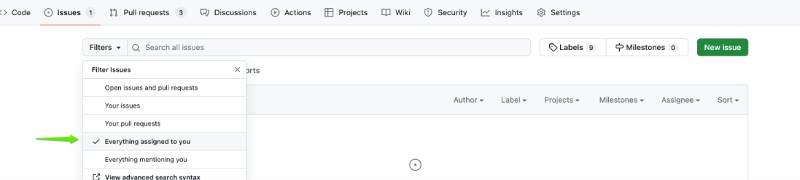

# Filters

::::{grid}
:::{grid-item-card} Question
:::

:::{grid-item-card} Réponse
:::

:::{grid-item-card} Explication
:::

:::{grid-item-card} Source
:::
::::

## type:repo

### Syntaxe

::::{grid}
:::{grid-item-card}
Peter Griffin wants to find GitHub repositories related to cats that have 10 or fewer stars.\
Which search query should he use to achieve this ?\
*Choose TWO correct answers.*
:::

:::{grid-item-card}
* `cats stars:~10`
* {bdg-success}`Correct` `cats stars:<=10`
* {bdg-success}`Correct` `cats stars:*..10`
* `cats stars:10`
:::

:::{grid-item-card}
Peter Griffin should use the search query `cats stars:<=10` or `cats stars:*..10` to find GitHub repositories related to cats with 10 or fewer stars.

`cats stars:<=10` matches repositories with the word "cats" that have 10 or fewer stars.
:::

:::{grid-item-card}
https://docs.github.com/en/search-github/searching-on-github/searching-for-repositories#search-by-number-of-stars
:::
::::

## type:issue,pr

### Menu

::::{grid}
:::{grid-item-card}
Lois is a project manager on GitHub and wants to filter all the open issues and pull requests in her repository to prioritize tasks.\
Which filtering option should she use?
:::

:::{grid-item-card}
Open issues and pull requests.
:::

:::{grid-item-card}
Lois should choose the option to filter for "Open issues and pull requests" to see all the active tasks in the repository, regardless of their assignees or creators.\
This filter will help her prioritize tasks based on their urgency and importance.
:::

:::{grid-item-card}
* L: https://docs.github.com/en/issues/tracking-your-work-with-issues/using-issues/filtering-and-searching-issues-and-pull-requests#filtering-issues-and-pull-requests
:::
::::

::::{grid}
:::{grid-item-card}
Meg is a team lead overseeing a project on GitHub.\
She wants to filter issues and pull requests to review tasks where team members have mentioned her for assistance or feedback.\
Which filtering option should she use ?
:::

:::{grid-item-card}
Everything mentioning you
:::

:::{grid-item-card}
You can also use `is:open mentions:@me` in search bar to get same results.

You can also use this URL to directly to see all the active tasks in the repository:
* `https://github.com/<USER-NAME>/<REPO-NAME>/issues?q=is:open+mentions:@me`
:::

:::{grid-item-card}
* https://docs.github.com/en/issues/tracking-your-work-with-issues/filtering-and-searching-issues-and-pull-requests#filtering-issues-and-pull-requests
:::
::::

::::{grid}
:::{grid-item-card}
Stewie is a developer working on a project with multiple contributors. He wants to filter issues and pull requests to see only those that are assigned to him.\
Which filtering option should he select?
:::

:::{grid-item-card}
* {bdg-success}`Correct` Everything assigned to you.
* Your issues.
* Open issues and pull requests.
* Your pull requests.
* Everything mentioning you.
:::

:::{grid-item-card}
Stewie should choose the option to filter for "Everything assigned to you" to focus on the tasks specifically assigned to him.\
This filter will help him efficiently manage his workload and address his assigned tasks promptly.

You can also use `is:open assignee:@me` in search bar to get same results.

You can also use this URL to directly to see all the active tasks in the repository.\
`https://github.com/<USER-NAME>/<REPO-NAME>/issues?q=is:open+assignee:@me`
:::

:::{grid-item-card}
* https://docs.github.com/en/issues/tracking-your-work-with-issues/using-issues/filtering-and-searching-issues-and-pull-requests#filtering-issues-and-pull-requests
:::
::::

### Syntax

::::{grid}
:::{grid-item-card}
Can issues or pull requests be filtered based on the most added reaction ?
:::

:::{grid-item-card}
* {bdg-success}`Correct` Yes
* No
:::

:::{grid-item-card}
:::

:::{grid-item-card}
* https://docs.github.com/en/issues/tracking-your-work-with-issues/using-issues/filtering-and-searching-issues-and-pull-requests#sorting-issues-and-pull-requests
:::
::::

::::{grid}
:::{grid-item-card}
Lois is a project manager using GitHub to track software development issues for her team.\
She wants to identify issues that have received a moderate level of discussion, specifically those with comments ranging from 500 to 1,000.\
Which search query should Lois use to achieve this ?
:::

:::{grid-item-card}
`comments:500..1000 is:issue`
:::

:::{grid-item-card}
:::

:::{grid-item-card}
* https://docs.github.com/en/search-github/searching-on-github/searching-issues-and-pull-requests#search-by-number-of-comments
:::
::::

::::{grid}
:::{grid-item-card}
The `involves` qualifier is a logical OR between the `author`, `assignee`, `mentions`, and `commenter` qualifiers for a single user.
:::

:::{grid-item-card}
* {bdg-success}`Correct` True
* False
:::

:::{grid-item-card}
:::

:::{grid-item-card}
:::
::::

::::{grid}
:::{grid-item-card}
Meg, a developer, is looking for open issues in her GitHub repository that have not been labeled, assigned to anyone, and have no comments yet.\
Which search query should Meg use to find these issues ?
:::

:::{grid-item-card}
`is:open is:issue no:label no:assignee comments:0`
:::

:::{grid-item-card}
:::

:::{grid-item-card}
:::
::::

::::{grid}
:::{grid-item-card}
Peter is searching for issues created before March 2024 in the "family-guy" project owned by QuizExperts.\
Which search query should he use ?
:::

:::{grid-item-card}
`repo:quiz-experts/family-guy created:<2024-03-01 type:issue`
:::

:::{grid-item-card}
:::

:::{grid-item-card}
:::
::::

::::{grid}
:::{grid-item-card}
Jillian is a project manager overseeing a software development project.\
She wants to filter and find pull requests opened in May 2023 that have a failed status.\
Which search query should she use ?
:::

:::{grid-item-card}
`created:2023-05-01..2023-05-31 status:failure type:pr`
:::

:::{grid-item-card}
:::

:::{grid-item-card}
* https://docs.github.com/en/search-github/getting-started-with-searching-on-github/understanding-the-search-syntax#query-for-dates
* https://docs.github.com/en/search-github/searching-on-github/searching-issues-and-pull-requests#search-by-commit-status
:::
::::

::::{grid}
:::{grid-item-card}
Peter wants to see all the issues and pull requests that are assigned to him in the project.\
Which filter option should he use ?
:::

:::{grid-item-card}
`is:open assignee:@me`
:::

:::{grid-item-card}
:::

:::{grid-item-card}
:::
::::

::::{grid}
:::{grid-item-card}
How can you filter issues or pull requests that have either the bug or error labels ?
:::

:::{grid-item-card}
`label:bug,error`
:::

:::{grid-item-card}
:::

:::{grid-item-card}
:::
::::

::::{grid}
:::{grid-item-card}
Which of the following options helps you search for issues with the "404 error" string in repositories owned by the QuizExperts organization ?
:::

:::{grid-item-card}
Search `"404 error" org:QuizExperts` and click on "Issues" under the "Filter by" section.
:::

:::{grid-item-card}
:::

:::{grid-item-card}
* https://docs.github.com/en/issues/tracking-your-work-with-issues/using-issues/filtering-and-searching-issues-and-pull-requests?tool=cli
:::
::::

::::{grid}
:::{grid-item-card}
What does the search qualifier `review-requested:[USERNAME]` allow you to find?
:::

:::{grid-item-card}
Pull requests where the specified user is requested for review.
:::

:::{grid-item-card}
:::

:::{grid-item-card}
* https://docs.github.com/en/pull-requests/collaborating-with-pull-requests/reviewing-changes-in-pull-requests/viewing-a-pull-request-review
:::
::::

::::{grid}
:::{grid-item-card}
How can you find issues that mention a specific user on GitHub ?
:::

:::{grid-item-card}
Use the `mentions:` followed by the username.
:::

:::{grid-item-card}
:::

:::{grid-item-card}
* https://docs.github.com/en/search-github/searching-on-github/searching-issues-and-pull-requests#search-by-mention
:::
::::

### Github CLI

::::{grid}
:::{grid-item-card}
Suppose you are leading a software development project on GitHub.\
To assist the team in prioritizing tasks and ensuring that critical issues are promptly addressed, you must compile a list of all issues without an assignee and bearing either the 'error' or 'bug' label, sorted by their creation date.\
Which of the following options, based on the provided reference, would help you accomplish this objective ?
:::

:::{grid-item-card}
* `gh issue list --search 'no:assignee labels:error,bug sort:created-asc'`
* `gh issue list --search --assignee=none --label=error --label=bug --sort=created-asc`
* `gh issue list --search --assignee=none --label=error,bug --sort=created-asc`
* {bdg-success}`Correct` `gh issue list --search 'no:assignee label:error,bug sort:created-asc'`
:::

:::{grid-item-card}
* `gh issue list --search 'no:assignee labels:error,bug sort:created-asc'`\
{bdg-danger}`Incorrect` erreur de typo de `label` qui est sans 's'.
* `gh issue list --search --assignee=none --label=error --label=bug --sort=created-asc`\
{bdg-danger}`Incorrect` a cause de l'option `--sort` qui n'existe pas.
* `gh issue list --search --assignee=none --label=error,bug --sort=created-asc`\
{bdg-danger}`Incorrect` a cause de l'option `--sort` qui n'existe pas.
* `gh issue list --search 'no:assignee label:error,bug sort:created-asc'`\
{bdg-success}`Correct`.
:::

:::{grid-item-card}
* https://docs.github.com/en/issues/tracking-your-work-with-issues/using-issues/filtering-and-searching-issues-and-pull-requests?tool=cli#using-search-to-filter-issues-and-pull-requests
:::
::::

### Sort

::::{grid}
:::{grid-item-card}
Donna is managing a GitHub repository for a software project with multiple contributors.\
She wants to prioritize reviewing the pull requests based on their activity and engagement.\
Which sorting option should she choose to see the pull requests?
:::

:::{grid-item-card}
The most commented pull requests.
:::

:::{grid-item-card}
:::

:::{grid-item-card}
* https://docs.github.com/en/issues/tracking-your-work-with-issues/using-issues/filtering-and-searching-issues-and-pull-requests#sorting-issues-and-pull-requests
:::
::::

## tag

### Milestones

#### Primary Purpose

::::{grid}
:::{grid-item-card}
What is the primary purpose of **milestones** in GitHub ?
:::

:::{grid-item-card}
To track progress on groups of issues or pull requests.
:::

:::{grid-item-card}
:::

:::{grid-item-card}
* https://docs.github.com/en/issues/using-labels-and-milestones-to-track-work/about-milestones
:::
::::

#### Scope

::::{grid}
:::{grid-item-card}
Can you filter GitHub issues based on **milestones** ?
:::

:::{grid-item-card}
Yes, GitHub allows filtering of issues based on **milestone**.
:::

:::{grid-item-card}
:::

:::{grid-item-card}
* https://docs.github.com/en/issues/using-labels-and-milestones-to-track-work/filtering-issues-and-pull-requests-by-milestone
:::
::::

#### Difference with **labels**

::::{grid}
:::{grid-item-card}
What is the primary difference between **milestones** and **labels** in GitHub ?
:::

:::{grid-item-card}
**Milestones** are project-specific and can be used to view details about progress, while **labels** are applied to individual issues or pull requests for categorization.
:::

:::{grid-item-card}
:::

:::{grid-item-card}
* https://docs.github.com/en/issues/using-labels-and-milestones-to-track-work
:::
::::

::::{grid}
:::{grid-item-card}
What is the primary difference between **milestones** and **labels** in GitHub?
:::

:::{grid-item-card}
Milestones are used to track project progress and completion, while labels are used to categorize issues and pull requests based on their attributes.
:::

:::{grid-item-card}
:::

:::{grid-item-card}
* https://docs.github.com/en/issues/using-labels-and-milestones-to-track-work
:::
::::

### Topics

::::{grid}
:::{grid-item-card}
Brian Griffin is a software developer who is interested in contributing to open source projects related to machine learning.\
He wants to explore repositories in this subject area to find projects to contribute to and discover new solutions.\
Which feature of GitHub would be most helpful for Brian in this scenario ?
:::

:::{grid-item-card}
**Topics**
:::

:::{grid-item-card}
:::

:::{grid-item-card}
* https://docs.github.com/en/repositories/managing-your-repositorys-settings-and-features/customizing-your-repository/classifying-your-repository-with-topics
:::
::::

::::{grid}
:::{grid-item-card}
Brian, a developer, is working on a private repository for a proprietary project for his company.\
He wants to organize the repository by adding specific **topics** relevant to the project's technology stack and functionalities.\
What is the visibility status of **topic** names created within a private repository on GitHub ?
:::

:::{grid-item-card}
* {bdg-success}`Correct` **Topic** names created in private repositories are always public.
:::

:::{grid-item-card}
GitHub maintains the visibility of **topic** names as public, regardless of whether they are created within private repositories.
This means that even though the repository itself is private and inaccessible to others, the **topics** associated with it are visible to all GitHub users.
:::

:::{grid-item-card}
https://docs.github.com/en/repositories/managing-your-repositorys-settings-and-features/customizing-your-repository/classifying-your-repository-with-topics#adding-topics-to-your-repository
:::
::::

::::{grid}
:::{grid-item-card}
Which of the following statements about the visibility of **topic** names is true ?
:::

:::{grid-item-card}
* **Topic** names created within a private repository are public only if the repository was public before.
* **Topic** names are private if created within a private repository.
* {bdg-success}`Correct` **Topic** names are always public.
* **Topic** names are visible only to collaborators of a repository.
:::

:::{grid-item-card}
**Topic** names are {bdg-primary}`always` public, even if you create the **topic** from within a private repository.

GitHub maintains **topic** names as public entities, ensuring that repositories classified under those **topics** are discoverable and accessible to all users.
:::

:::{grid-item-card}
* https://docs.github.com/en/repositories/managing-your-repositorys-settings-and-features/customizing-your-repository/classifying-your-repository-with-topics#adding-topics-to-your-repository
:::
::::

::::{grid}
:::{grid-item-card}
Stewie manages a public repository on GitHub for his robotics projects. He wants to improve the visibility of his repository by adding relevant topics.\
Which of the following statements is true regarding GitHub's **topic** suggestion feature for his repository ?
:::

:::{grid-item-card}
GitHub analyzes public repository content and generates suggested **topics** that Stewie can accept or reject.
:::

:::{grid-item-card}
:::

:::{grid-item-card}
* https://docs.github.com/en/repositories/managing-your-repositorys-settings-and-features/customizing-your-repository/classifying-your-repository-with-topics#about-topics
:::
::::

::::{grid}
:::{grid-item-card}
Where do **topics** appear once added to a repository ?
:::

:::{grid-item-card}
On the main page of the repository.
:::

:::{grid-item-card}
:::

:::{grid-item-card}
* https://docs.github.com/en/enterprise-server@3.10/repositories/managing-your-repositorys-settings-and-features/customizing-your-repository/classifying-your-repository-with-topics#about-topics
:::
::::

::::{grid}
:::{grid-item-card}
How can you classify your repository to help others discover and contribute to your project more easily ?
:::

:::{grid-item-card}
Add relevant **topics** related to your project's purpose, subject area, or groups of interest.
:::

:::{grid-item-card}
:::

:::{grid-item-card}
* https://docs.github.com/en/enterprise-server@3.10/repositories/managing-your-repositorys-settings-and-features/customizing-your-repository/classifying-your-repository-with-topics
:::
::::

### Label

::::{grid}
:::{grid-item-card}
Who can edit existing **labels** in a GitHub repository ?
:::

:::{grid-item-card}
Anyone with `write` access to the repository.
:::

:::{grid-item-card}
:::

:::{grid-item-card}
* https://docs.github.com/en/issues/using-labels-and-milestones-to-track-work/managing-labels#editing-a-label
:::
::::

::::{grid}
:::{grid-item-card}
Who can customize the default **labels** for repositories in their organization ?
:::

:::{grid-item-card}
Organization owners
:::

:::{grid-item-card}
:::

:::{grid-item-card}
* https://docs.github.com/en/issues/using-labels-and-milestones-to-track-work/managing-labels#about-default-labels
:::
::::

::::{grid}
:::{grid-item-card}
What **label** does a maintainer use to indicate that they require assistance with an issue or pull request ?
:::

:::{grid-item-card}
`help wanted`
:::

:::{grid-item-card}
:::

:::{grid-item-card}
* https://docs.github.com/en/issues/using-labels-and-milestones-to-track-work/managing-labels#about-labels
:::
::::

::::{grid}
:::{grid-item-card}
What is the significance of adding **labels** to a pull request ?
*Choose TWO correct answers.*
:::

:::{grid-item-card}
* {bdg-success}`Correct` It categorizes the nature of the changes being proposed.
* {bdg-success}`Correct` To provide visual clues for the purpose of the pull request.
:::

:::{grid-item-card}
**Labels** in a pull request serve as visual clues for the purpose of the pull request, helping maintainers understand the nature of the changes being proposed in a pull request, such as whether it's a bug fix, an enhancement, or related to documentation.\
A maintainer might also add a **label** or multiple **labels**.

Some of the labels we use in the repository for this Learn module are:
* **Bug (red)**: Something isn't working
* **Documentation (blue)**: Improvements or additions to documentation
* **Duplicate (gray)**: This issue or pull request already exists
* **Enhancement (teal)**: New feature or request
:::

:::{grid-item-card}
* https://learn.microsoft.com/en-us/training/modules/contribute-open-source/4-exercise-create-pr
:::
::::

::::{grid}
:::{grid-item-card}
Why would a company need **labels** in GitHub for its projects ?
:::

:::{grid-item-card}
To categorize and prioritize issues, pull requests, and discussions.
:::

:::{grid-item-card}
:::

:::{grid-item-card}
* ttps://docs.github.com/en/issues/using-labels-and-milestones-to-track-work/managing-labels
:::
::::

#### default 

::::{grid}
:::{grid-item-card}
Which of the following is **NOT** a default label provided by GitHub in every new repository ?
:::

:::{grid-item-card}
`feature`
:::

:::{grid-item-card}
:::

:::{grid-item-card}
* https://docs.github.com/en/issues/using-labels-and-milestones-to-track-work/managing-labels#about-default-labels
:::
::::

##### `good first issue`

::::{grid}
:::{grid-item-card}
What is the purpose of the `good first issue` **label** in GitHub repositories ?
:::

:::{grid-item-card}
To identify issues suitable for first-time contributors.
:::

:::{grid-item-card}
:::

:::{grid-item-card}
* https://docs.github.com/en/issues/using-labels-and-milestones-to-track-work/managing-labels#about-default-labels
:::
::::
