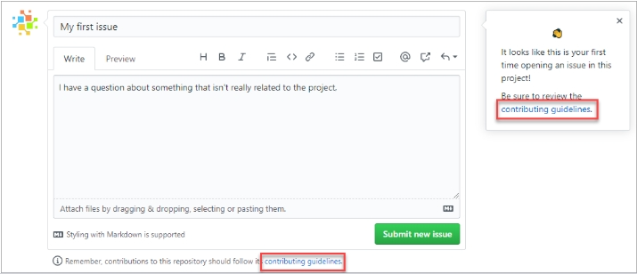

# Doc

::::{grid}
:::{grid-item-card}
:::

:::{grid-item-card}
:::

:::{grid-item-card}
:::

:::{grid-item-card}
:::
::::

## `CONTRIBUTING.md`

### Primary purpose

::::{grid}
:::{grid-item-card}
What is the purpose of a `CONTRIBUTING.md` file in an InnerSource project ?
:::

:::{grid-item-card}
To explain the contribution policy for the project and guide potential contributors.


:::

:::{grid-item-card}
:::

:::{grid-item-card}
* https://learn.microsoft.com/en-us/training/modules/manage-innersource-program-github/2-manage-innersource-program
* https://docs.github.com/en/communities/setting-up-your-project-for-healthy-contributions/setting-guidelines-for-repository-contributors
:::
::::

## `README.md`

### Primary purpose
::::{grid}
:::{grid-item-card}
What can you do to make a repository more discoverable ?\
*Choose TWO correct answers.*
:::

:::{grid-item-card}
* {bdg-success}`Correct` Add Relevant topics.
* {bdg-success}`Correct` Use descriptive README.md files.
:::

:::{grid-item-card}
To make your project easier to find and engage with, you can add relevant topics that describe what your project is about.\
These topics act like labels, helping others who are interested in similar things discover your project more easily.

Think of it like adding tags to your project.\
When someone searches for those tags, your project will show up in the results.\
It's like putting your project on the map for others to find!

Also, consider adding a `README` file. This is like a welcome sign for your project.\
It tells visitors what your project does, why it's useful, and how they can get started using it.\
It's a great way to introduce your project to the world!


```{note}
Topic names are always public, even if you create the topic from within a private repository.
```
:::

:::{grid-item-card}
https://docs.github.com/en/repositories/managing-your-repositorys-settings-and-features/customizing-your-repository/classifying-your-repository-with-topics#about-topics
:::
::::

### File location 

::::{grid}
:::{grid-item-card}
What happens if Lois places the `README` file in the **root** directory of her repository and also in the `.github` directory ?
:::

:::{grid-item-card}
Only the `README` file in the `.github` directory will be shown.
:::

:::{grid-item-card}
:::

:::{grid-item-card}
* https://docs.github.com/en/repositories/managing-your-repositorys-settings-and-features/customizing-your-repository/about-readmes#about-readmes
:::
::::

### Profile

::::{grid}
:::{grid-item-card}
How can you make a README file appear on your GitHub profile automatically ?
:::

:::{grid-item-card}
Name the `README` file after your username.
:::

:::{grid-item-card}
To display a `README` on your GitHub profile, create a public repository with the same name as your GitHub username (for example, if your username is `quizexpert`, the repository should also be named `quizexpert`).

Place a `README.md` file in the **root** directory of this repository.\
GitHub will automatically render the contents of this `README` at the top of your profile page, allowing you to introduce yourself, showcase projects, or share updates using GitHub Flavored Markdown.
:::

:::{grid-item-card}
* https://docs.github.com/en/account-and-profile/how-tos/profile-customization/managing-your-profile-readme
:::
::::

### Relative link

::::{grid}
:::{grid-item-card}
What is the advantage of using relative links in `README` files ?
:::

:::{grid-item-card}
They ensure that links work regardless of the current branch.
:::

:::{grid-item-card}
Relative links in `README` files ensure that links work regardless of the current branch, as GitHub automatically transforms relative links or image paths based on the branch the user is currently on.\
This makes relative links more reliable for users who clone the repository.
:::

:::{grid-item-card}
* https://docs.github.com/en/repositories/managing-your-repositorys-settings-and-features/customizing-your-repository/about-readmes#relative-links-and-image-paths-in-readme-files
:::
::::

::::{grid}
:::{grid-item-card}
Which type of link is recommended for referring to other files within your repository in a `README` file?
:::

:::{grid-item-card}
Relative links
:::

:::{grid-item-card}
:::

:::{grid-item-card}
* https://docs.github.com/en/repositories/managing-your-repositorys-settings-and-features/customizing-your-repository/about-readmes#relative-links-and-image-paths-in-readme-files
:::
::::

## Wiki

### Access

::::{grid}
:::{grid-item-card}
What is true about the **wiki** of a private repository ?
:::

:::{grid-item-card}
Only people with access to the repository can access the **wiki**.
:::

:::{grid-item-card}
:::

:::{grid-item-card}
* https://docs.github.com/en/communities/documenting-your-project-with-wikis/about-wikis
:::
::::

### Clone

::::{grid}
:::{grid-item-card}
How can you clone a **wiki** from a GitHub repository to your local computer ?
:::

:::{grid-item-card}
Using the `git clone` command with the repository's URL followed by `.wiki.git`.
:::

:::{grid-item-card}
:::

:::{grid-item-card}
* https://docs.github.com/en/communities/documenting-your-project-with-wikis/adding-or-editing-wiki-pages#adding-or-editing-wiki-pages-locally
:::
::::

### Title

::::{grid}
:::{grid-item-card}
What determines the title of a **wiki** page and how its content is rendered ?
:::

:::{grid-item-card}
The filename and its extension.
:::

:::{grid-item-card}
:::

:::{grid-item-card}
* https://docs.github.com/en/communities/documenting-your-project-with-wikis/adding-or-editing-wiki-pages#about-wiki-filenames
:::
::::

### Footer and Sidebar

::::{grid}
:::{grid-item-card}
How does GitHub determine which file to use for populating the footer and sidebar of a **wiki** ?
:::

:::{grid-item-card}
using the file names `_Footer.<extension>` and `_Sidebar.<extension>`.
:::

:::{grid-item-card}
:::

:::{grid-item-card}
* https://docs.github.com/en/communities/documenting-your-project-with-wikis/creating-a-footer-or-sidebar-for-your-wiki#creating-a-footer-or-sidebar-locally
:::
::::

### Disable

::::{grid}
:::{grid-item-card}
What happens to the content of a wiki when you turn it off?
:::

:::{grid-item-card}
The content is hidden but can be restored later.
:::

:::{grid-item-card}
:::

:::{grid-item-card}
* https://docs.github.com/en/communities/documenting-your-project-with-wikis/disabling-wikis
:::
::::

## Markdown

### Syntax

::::{grid}
:::{grid-item-card}
Which of the following is a valid Markdown syntax ?
:::

:::{grid-item-card}
* `<-- This content will no appear in the rendered Markdown -->`
* `(link text for page)[URL to a page]`
* `*Will appear as bold text in the rendered Markdown*`
* {bdg-success}`Correct` `# Will appear as a heading line in the rendered Markdown`
* `- Will apear as a ordered list in the rendered Markdown`
:::

:::{grid-item-card}
* `<-- This content will no appear in the rendered Markdown -->`\
{bdg-danger}`Incorrect` missing `!` in open tag `<!--`
* `(link text for page)[URL to a page]`\
{bdg-danger}`Incorrect` it reverse : `[text](URL)`
* `*Will appear as bold text in the rendered Markdown*`\
{bdg-danger}`Incorrect` one `*`  for `*italic*`, two `*` for `**bold**`
* `# Will appear as a heading line in the rendered Markdown`\
{bdg-success}`Correct` 
* `- Will apear as a ordered list in the rendered Markdown`\
{bdg-danger}`Incorrect` the `-` is for unordered list. For ordered list, use number `1. text`
:::

:::{grid-item-card}
:::
::::

#### Emphasize

::::{grid}
:::{grid-item-card}
Lois is learning how to format text using Markdown on GitHub.\
She wants to emphasize certain words or phrases by making them bold.\
Which of the following examples demonstrates the correct way to bold the middle of a word for emphasis ?
:::

:::{grid-item-card}
`Quiz**Experts**PracticeTest`
:::

:::{grid-item-card}
:::

:::{grid-item-card}
* https://docs.github.com/en/get-started/writing-on-github/getting-started-with-writing-and-formatting-on-github/basic-writing-and-formatting-syntax#styling-text
:::
::::

#### Link

::::{grid}
:::{grid-item-card}
How can you add a link in a wiki page using Markdown syntax ?
:::

:::{grid-item-card}
`[Link Text](URL)`
:::

:::{grid-item-card}
:::

:::{grid-item-card}
* https://docs.github.com/en/get-started/writing-on-github/getting-started-with-writing-and-formatting-on-github/basic-writing-and-formatting-syntax#links
:::
::::

#### Escape

::::{grid}
:::{grid-item-card}
Meg Griffin is working on a README file for her project on GitHub. She wants to include an example command that contains an asterisk (*) character without it being interpreted as Markdown formatting. Which approach should Meg use to ensure the asterisk (*) character is not interpreted as Markdown formatting in her README file?
:::

:::{grid-item-card}
Use backslashes before the asterisk (*)
:::

:::{grid-item-card}
:::

:::{grid-item-card}
* https://docs.github.com/en/get-started/writing-on-github/getting-started-with-writing-and-formatting-on-github/basic-writing-and-formatting-syntax#ignoring-markdown-formatting
:::
::::

## Slash command

### Primary purpose

::::{grid}
:::{grid-item-card}
In which section of a GitHub repository can slash commands be used to insert complex Markdown ?
:::

:::{grid-item-card}
Issues and pull request descriptions
:::

:::{grid-item-card}
Slash commands in GitHub can be used in any description or comment field in issues, pull requests, or discussions. This includes adding complex Markdown such as code blocks, tables, details, tasklists, and more directly within issues and pull request descriptions.
:::

:::{grid-item-card}
* https://docs.github.com/en/issues/tracking-your-work-with-issues/using-issues/about-slash-commands
:::
::::

::::{grid}
:::{grid-item-card}
What is the purpose of slash commands on GitHub ?
:::

:::{grid-item-card}
To reduce typing required for complex Markdown.
:::

:::{grid-item-card}
Slash commands on GitHub are designed to make it easier to type complex Markdown, such as tables, tasklists, and code blocks, by reducing the amount of typing required.
:::

:::{grid-item-card}
* https://docs.github.com/en/issues/tracking-your-work-with-issues/using-issues/about-slash-commands
:::
::::

::::{grid}
:::{grid-item-card}
Meg is a student who recently started using GitHub for her programming assignments.\
She's curious about how slash commands can improve her workflow on GitHub ?
:::

:::{grid-item-card}
GitHub slash commands are shortcuts that allow users to perform various actions directly from the comment box or issue description, 
facilitating efficient collaboration and task management.
:::

:::{grid-item-card}
:::

:::{grid-item-card}
* https://docs.github.com/en/issues/tracking-your-work-with-issues/using-issues/about-slash-commands
:::
::::

### Syntax

#### /details

::::{grid}
:::{grid-item-card}
Meg, a software developer, wants to provide additional context within an issue discussion in her GitHub repository.\
She is exploring options for creating collapsible detail areas to hide supplementary information.\
How can she create it in a GitHub comment or description ?
:::

:::{grid-item-card}
By using the `/details` slash command and providing a title and content for the collapsible section.
:::

:::{grid-item-card}
:::

:::{grid-item-card}
* https://docs.github.com/en/issues/tracking-your-work-with-issues/using-issues/about-slash-commands
:::
::::

::::{grid}
:::{grid-item-card}
Lois, a project manager, is exploring ways to enhance collaboration within her team's GitHub repository. She wants to understand the functionality of the `/details` slash command.\
What is the purpose of the `/details` slash command in GitHub?
:::

:::{grid-item-card}
It creates a collapsible detail area with customizable content.
:::

:::{grid-item-card}
The `/details` slash command in GitHub allows users to create a collapsible detail area within comments and descriptions.\
This feature is useful for presenting information in a structured and organized manner, with the ability to expand or collapse the content as needed.
:::

:::{grid-item-card}
* https://docs.github.com/en/issues/tracking-your-work-with-issues/using-issues/about-slash-commands
:::
::::

#### /table

::::{grid}
:::{grid-item-card}
Lois, a software developer, wants to improve the documentation within her GitHub repository by inserting a Markdown table into a comment.\
How can a developer insert a Markdown table into a GitHub comment or description ?
:::

:::{grid-item-card}
By using the `/table` slash command and specifying the number of columns and rows.
:::

:::{grid-item-card}
:::

:::{grid-item-card}
* https://docs.github.com/en/issues/tracking-your-work-with-issues/using-issues/about-slash-commands#using-slash-commands
:::
::::
